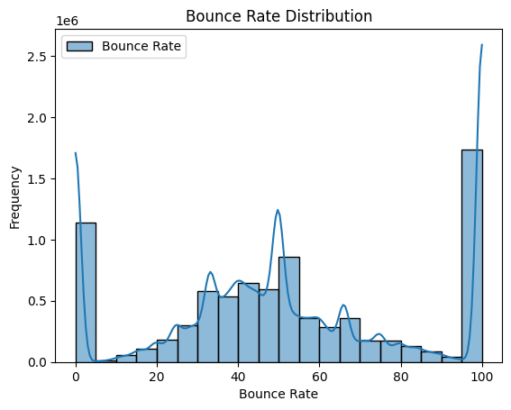
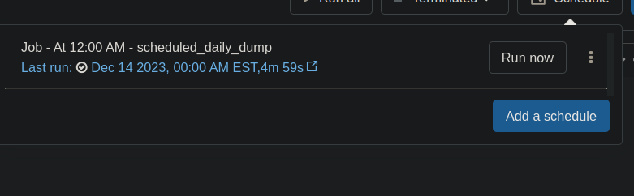

# Databricks ETL (Extract Transform Load) Pipeline

This repository contains an ETL (Extract, Transform, Load) pipeline for processing website traffic data.

### Overview
The ETL pipeline performs the following key steps:

Extracts website traffic data from a CSV file into a PySpark DataFrame
Transforms the data by adding derived columns, casting columns types, etc.
Loads the transformed data into Delta Lake for further analysis
The main script to execute the pipeline is `etl/main.py`.

### Pipeline Details
Extract

The raw website traffic data in CSV format is extracted using the extract() function defined in `extract/extract.py`. Key parameters:

Input file path
File type (CSV)
Whether to infer schema
Whether first row is header
Column delimiter
The output is a PySpark DataFrame.

Transform

Key transformations on the PySpark DataFrame:

transform_date_columns() in `transform/transform_data.py`:
Derived columns based on date like day, month, year etc.
transform_data():
Added columns like hour, day of week
Window functions like ranks, lag, lead etc.
cast_columns(): Cast column types like sessions to integer
The output is the transformed PySpark DataFrame.

Load
The transformed data is loaded into Delta Lake for further analysis. The path for Delta Lake is specifed during the load process.

### Visualisations 
Vistors bounce rate distribution

Detailed Scatter Plot of Bounce Rate

### Scheduling

